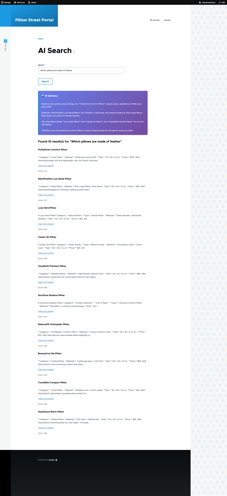

# AI Chat Module

A Drupal module that provides an AI-powered search interface combining Search API results with Google Gemini-generated summaries.



## Features

- Search interface using Search API indexes
- AI-generated summaries using Google Gemini API
- Configurable search index
- Fallback to basic summaries when AI is unavailable

## Requirements

### Dependencies
- **Search API module** (required)
- **Drupal 10+**

### Search API Configuration
- At least one Search API index must be configured and enabled
- Index should contain content with `body` and `uid` fields for optimal results
- Entities must have canonical URL templates for proper linking

### Environment Variables
- **GEMINI_API_KEY** - Required for AI summary generation
  - Without this key, the module falls back to basic summaries
  - Get your API key from [Google AI Studio](https://makersuite.google.com/app/apikey)

## Installation

1. Enable the module: `drush en ai_chat`
2. Set up your Search API index
3. Configure the environment variable: `export GEMINI_API_KEY="your-api-key"`
4. Clear cache: `drush cr`

## Configuration

### Search Index Configuration

By default, the module uses a Search API index named 'index'. To use a different index:

1. Open `src/Form/SearchForm.php`
2. Modify line 22:
   ```php
   public const SEARCH_INDEX_ID = 'your_index_name';
   ```
3. Clear cache: `drush cr`

Common Search API index names:
- `content`
- `default_solr_index` 
- `site_search`

### Permissions

The chat interface is accessible at `/chat` with open access by default. You may want to configure proper permissions based on your site's needs.

## Usage

1. Navigate to `/chat`
2. Enter your search query
3. View AI-generated summary and search results

## Troubleshooting

### No search results
- Verify your Search API index is enabled and has indexed content
- Check that the `SEARCH_INDEX_ID` constant matches your actual index name

### No AI summaries
- Verify `GEMINI_API_KEY` environment variable is set
- Check Drupal logs for Gemini API errors
- Module will fall back to basic summaries if AI fails

### Search errors
- Check Drupal logs in the 'ai_chat' channel
- Verify Search API index configuration
- Ensure indexed content has required fields (`body`, `uid`)

## Customization

### Styling
- Custom CSS can be added via the included `ai_chat/ai-summary` library
- Twig template: `templates/ai-summary.html.twig`

### AI Prompts
- Modify the system prompt in `SearchForm.php` line 170-177
- Adjust the user prompt in line 180

## Support

For issues and feature requests, please use your project's issue tracking system.